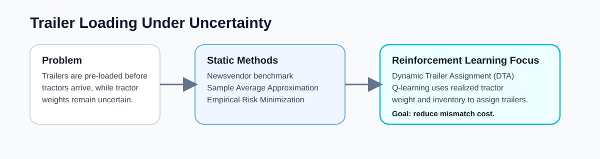
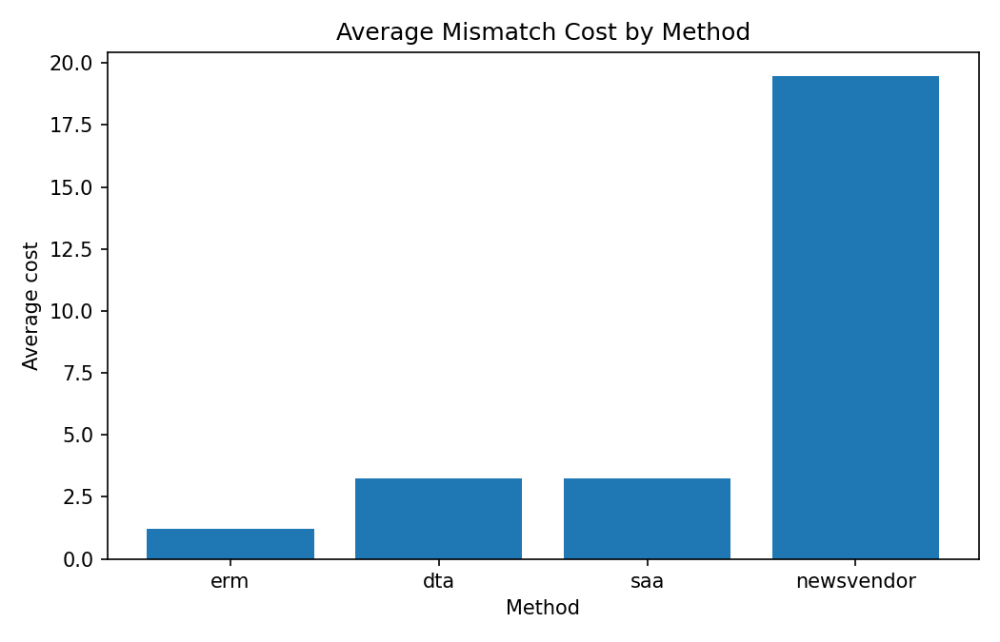
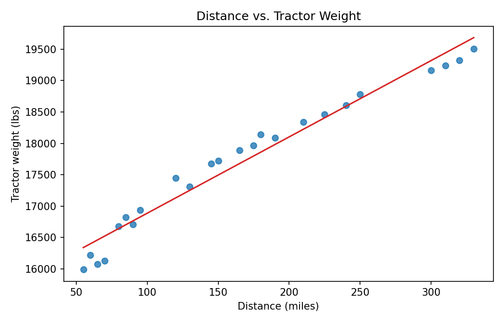
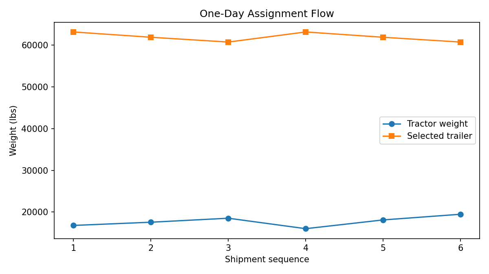

# ABI Trailer Allocation

`abi-trailer-allocation` is a research-oriented Python project on trailer loading and shipment planning under uncertainty, with a particular emphasis on reinforcement learning for dynamic trailer assignment.

This public repository reorganizes dissertation-era code into a modular, reproducible research codebase suitable for an academic portfolio and for future methodological extension.

**Related publication:** [ScienceDirect article](https://www.sciencedirect.com/science/article/abs/pii/S0925527323002116)



## Problem Statement

This project studies ABI's trailer loading and shipment problem when trailers must be pre-loaded before tractors arrive, while tractor weights remain uncertain. The operational challenge is to balance under-loading costs against overweight rework costs under a fixed gross-weight limit.

## Key Results

The repository highlights the progression from static optimization methods to reinforcement learning-based dynamic trailer assignment. In the original research, the reinforcement learning component is the most distinctive contribution because it uses realized tractor information and remaining inventory to improve assignment decisions.







## Methods

The project implements four methods motivated by the dissertation and publication:

- a Newsvendor benchmark
- sample average approximation (SAA)
- empirical risk minimization (ERM)
- dynamic trailer assignment (DTA) with Q-learning
- configurable experiments
- public-safe synthetic demo data
- evaluation and visualization utilities

The repository does not include proprietary ABI shipment data, private spreadsheets, or unrelated legacy files from the original working directory.

## Why This Repo Exists

The original dissertation working folder mixed together:

- repeated month-specific scripts such as `Feb_revised.py` and similar copies
- notebooks and checkpoint files
- Excel training and test workbooks
- draft documents and unrelated files
- method prototypes without a reusable package structure

This public repo reorganizes that work into a maintainable research codebase suitable for GitHub.

The core methodological framing is:

- `Newsvendor`: a Gaussian benchmark using historical tractor weight moments
- `SAA`: empirical optimization over observed historical samples
- `ERM`: a linear decision rule `q(d) = q0 + q1 d` trained by minimizing empirical mismatch cost
- `DTA`: a dynamic trailer assignment policy trained with tabular Q-learning

## Public Data Policy

This repo does **not** ship original ABI data.

Included instead:

- a small synthetic shipment dataset for demos and tests
- a data interface that can be pointed at a local private CSV
- documentation for the expected data schema

## Repository Layout

```text
abi-trailer-allocation/
├── README.md
├── LICENSE
├── .gitignore
├── requirements.txt
├── data/
├── configs/
├── src/
├── scripts/
├── notebooks/
├── outputs/
└── tests/
```

## Legacy-To-New Mapping

- legacy repeated monthly scripts -> `src/abi_trailer/methods/` plus config-driven scripts
- ad hoc cost formulas -> `src/abi_trailer/cost.py`
- notebook-only experiments -> `src/abi_trailer/evaluation.py` and `scripts/`
- mixed training/test spreadsheets -> documented schema in `data/README.md`
- Gurobi-only ERM prototype -> open-source `scipy.optimize.linprog` implementation

## Quick Start

Install dependencies:

```bash
python3 -m pip install -r requirements.txt
```

Run the bundled public demo:

```bash
python3 scripts/run_saa.py
python3 scripts/run_erm.py
python3 scripts/run_dta.py
python3 scripts/make_figures.py
```

Generated artifacts are written to `outputs/generated/`.

## Demo Outputs

The public demo can generate:

- tractor weight vs. distance scatter plot
- method cost comparison chart
- one-day assignment flow visualization
- inventory sensitivity plot

## Data Schema

Expected columns for local private data:

- `shipment_id`
- `ship_date`
- `distance_miles`
- `tractor_weight_lbs`
- `carrier_group` (optional)

## Notes On Reproducibility

- The bundled synthetic data is for demonstration only.
- Public results will not numerically match the original dissertation because the original operational data is not included.
- The ERM implementation uses SciPy rather than Gurobi to keep the public repo easier to reproduce.

## Next Extensions

Natural future extensions include:

- rolling monthly backtests
- carrier-specific ERM rules
- deeper RL variants
- richer synthetic scenario generation
